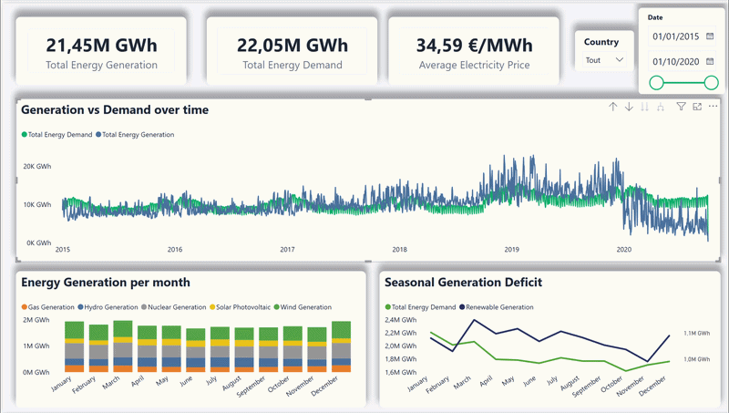

# 🇪🇺 European Energy Grid & Transition Modeling (2015–2020)

## 📊 Executive Overview

This end-to-end **data engineering and analytics project** models European electricity grid data to evaluate national clean-energy transition targets.

Using a multi-stage **Python & PostgreSQL data pipeline** and an interactive **Power BI executive dashboard**, the analysis quantifies the **"Renewable Gap"** — the structural deficit between total electricity demand and available clean-energy generation.
---

## 📽️ Interactive Dashboard Preview



> 💡 *Note: The interactive `.pbix` file is available in the [`/dashboard/`](./dashboard/) directory.*
> 
---

## 🔑 Key Analytical Insights

### ⚡ The Supply Deficit

Across the 2015–2020 baseline:

- **Cumulative grid demand:** 22.05M GWh
- **Domestic electricity supply:** 21.45M GWh
- **Structural deficit:** ~0.60M GWh

This gap highlights potential **energy import dependencies**, particularly during periods of peak demand.

### 🌦️ Seasonal Supply Mismatch

Variable renewable sources such as **solar and wind** expand significantly during high-production periods. However, total renewable generation declines during high-demand winter months, exposing a critical **seasonal flexibility gap**. 

### ☢️ Thermal & Nuclear Phase-Out Challenge

Nuclear and gas generation currently provide essential baseline stability. The **Seasonal Generation Deficit** analysis quantifies the exact gigawatt-hour shortfall that must be covered by solar, wind, and storage expansion to progressively replace legacy thermal capacity.

---

## 🛠️ Data Pipeline & Architecture

### 1. Extract, Clean & Load (Python)

Ingested **multi-gigabyte hourly electricity generation and load datasets** covering European regions from **2015–2020**.

Built custom **Python scripts (Pandas)** for initial data extraction, high-volume CSV cleaning, missing-value handling, and database staging.

### 2. Relational Data Modeling (PostgreSQL)

Designed a **Star Schema** to enforce referential integrity and support rapid querying:

**Fact table:** `fact_grid_data`

**Dimension tables:** `dim_region`, `dim_energy_source`, `dim_time`

Key SQL Tasks:

- Cleaned orphaned foreign keys to permanently eliminate blank ((Vide)) slicer categories.
- Formatted timestamp structures and built dimensional mappings across energy categories.
- Created baseline generation datasets for complete fuel-mix visualization.

### 3. Business Intelligence & DAX (Power BI)

Developed an executive reporting interface structured into 3 visual layers:

- **Executive KPI Cards**: Instant metrics for **Total Energy Generation (21.45M GWh)**, **Total Energy Demand (22.05M GWh)**, and **Average Electricity Price (34.59 €/MWh)**.
- **Generation vs Demand Over Time (Area/Line Chart)**: Historical 2015–2020 trend mapping continuous generation profiles directly against total grid load.
- **Energy Generation per Month (Stacked Bar Chart)**: Granular monthly breakdown displaying proportional fuel contributions from **Gas**, **Hydro**, **Nuclear**, **Solar**, and **Wind**.
- **Seasonal Generation Deficit (Line Chart)**: Compares total demand directly against clean energy production across the calendar year to highlight seasonal supply shortfalls.

The reporting layer follows a **3-tier analytical structure**:

1. **Executive KPIs** — high-level energy indicators
2. **Long-term trends** — 2015–2020 evolution
3. **Granular monthly analysis** — fuel-mix and seasonal dynamics

---

## 🎯 Strategic Modeling & Next Steps

### Scenario Modeling

The next stage will introduce **DAX What-If Parameters** to simulate **0 MW nuclear baseline**. The model will calculate the required gigawatt expansion in:

- ☀️ Solar Photovoltaic
- 🌬️ Wind Generation
- 💧 Pumped-Hydro Storage
- 🔋 Battery Energy Storage Systems (BESS)

to assess whether clean energy can systematically cover peak winter demand without grid failure.

---

## 🔧 Technology Stack

| Category | Technologies |
|---|---|
| **Data Extraction & Prep** | Python (Pandas) |
| **Database & ETL** | PostgreSQL, SQL |
| **Data Modeling** | Star Schema (Fact/Dimension Design) |
| **Business Intelligence** | Power BI Desktop |
| **Analytics & DAX** | Power Query, DAX Measures |
| **Domain** | European Energy Grid & Electricity Markets |
---
## 📂 Project Structure

```text
project-1/
│
├── dashboard/
│   ├── European_Energy_Grid.pbix    # Main Power BI interactive dashboard file
│   ├── European_Energy_Grid.pdf     # PDF export / printable view of the dashboard
│   ├── dashboard_preview.mp4        # mp4 preview of the dashboard
│   └── DAX_measures.txt             # Centralized repository of DAX measures & logic
│
├── notebooks/
│   └── cleaning.py                  # Python Pandas ETL script for data preprocessing
│
├── sql/
│   ├── schema.sql                   # Star schema creation scripts (DDL)
│   ├── Refinement.sql               # Data manipulation & synthetic gap filling (DML)
│   ├── analytical_queries.sql       # Complex analytical queries & aggregations
│   └── verify_data_integrity.sql    # Orphaned keys and NULL integrity checks
│
└── README.md                        # Documentation & project overview
